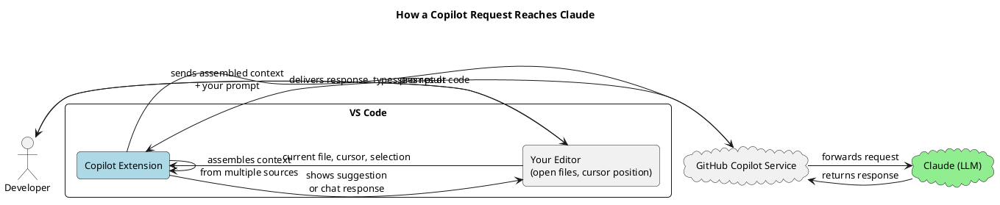
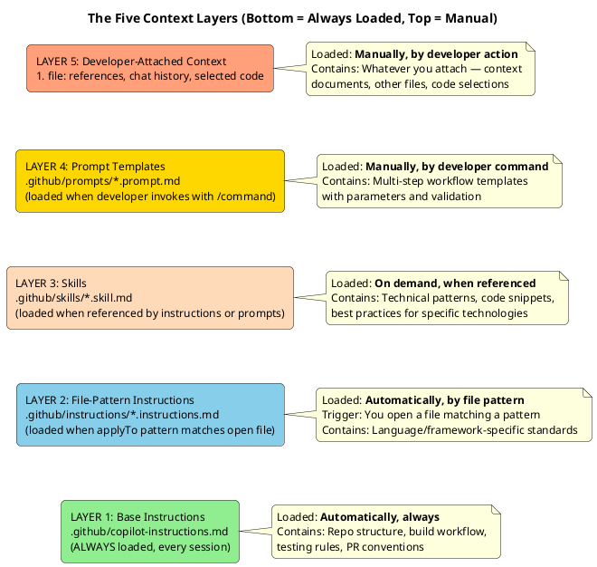
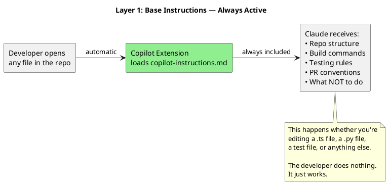
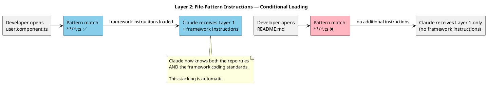
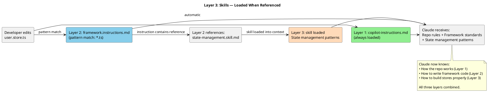
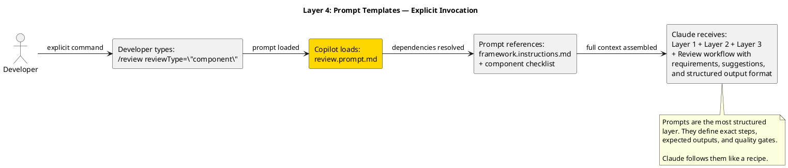
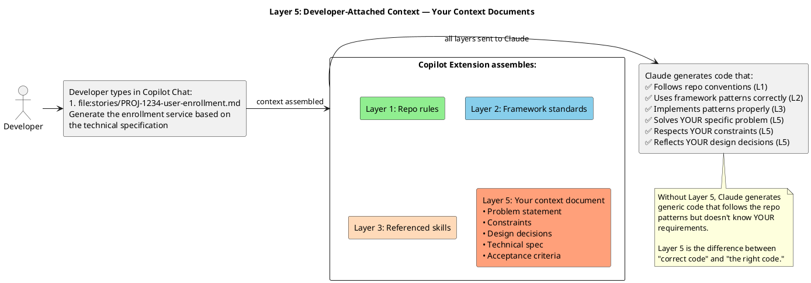
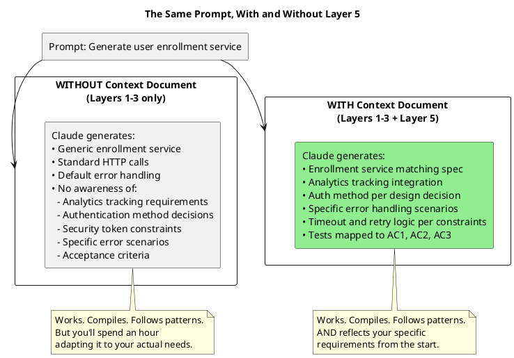
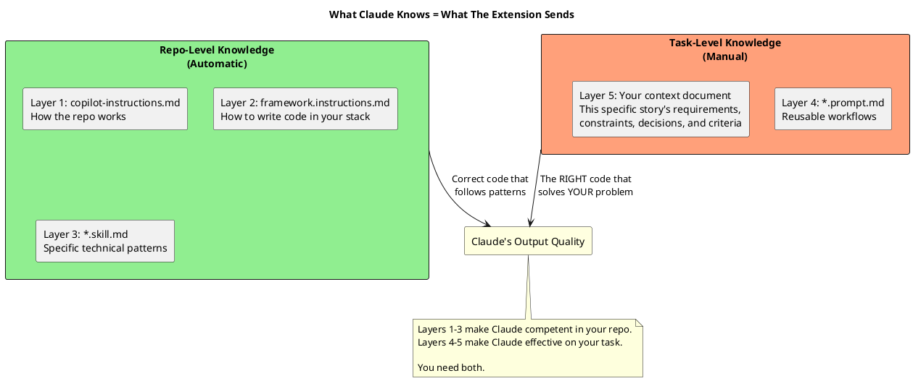

# How Context Works in GitHub Copilot with Claude

> A visual guide to understanding what Claude sees when you use GitHub Copilot

---

## The Big Picture

When you type a prompt in Copilot Chat or accept an inline suggestion, you're not talking directly to Claude. You're talking to the **Copilot extension**, which assembles context from multiple sources, packages it into a single request, and sends it to Claude. Claude never sees your repo directly — it only sees what the extension decides to include.

Think of it like a briefing package. The Copilot extension is the assistant who prepares the briefing. Claude is the executive who reads it and makes decisions. The quality of Claude's output depends entirely on what's in that briefing.



**Key insight:** Claude is powerful, but it can only work with what it receives. If the Copilot extension doesn't include a piece of context, Claude doesn't know it exists. This is why understanding the context assembly process matters.

---

## The Five Layers of Context

The Copilot extension assembles context from five sources, each with different loading rules. They stack on top of each other — Claude receives all applicable layers merged into one context window.



---

## Layer by Layer: What Each One Does

### Layer 1: Base Instructions (Always On)

**File:** `.github/copilot-instructions.md`

**When loaded:** Every single Copilot interaction in the repo. No exceptions. No action required from the developer.

**What it tells Claude:**
- How the repository is structured (monorepo layout, project locations, shared libraries)
- How to build and test (which tools, which commands, which configurations)
- What conventions to follow (linting rules, commit hooks, PR standards)
- What not to do (don't break shared configs, don't edit production code without permission)

**Analogy:** This is the employee handbook. Every new hire reads it on day one. It covers the rules that apply to everything, everywhere, always.



---

### Layer 2: File-Pattern Instructions (Automatic, Conditional)

**File:** `.github/instructions/<framework>.instructions.md`

**When loaded:** Automatically, when the developer opens or edits a file matching the `applyTo` pattern.

**Example patterns:**
- `**/*.ts, **/*.html, **/*.scss` → loads Angular/TypeScript instructions
- `**/*.py` → loads Python instructions
- `**/*.java` → loads Java/Spring instructions
- `**/*.spec.ts, **/*.test.ts` → loads testing-specific instructions

**What it tells Claude (in addition to Layer 1):**
- Framework-specific coding standards
- Preferred patterns and conventions
- Architecture rules (component design, state management, dependency injection)
- Testing patterns specific to the framework

**Analogy:** This is the department-specific training manual. A frontend developer gets frontend rules. A backend developer gets backend rules. Each set loads automatically based on what file you're working on.



---

### Layer 3: Skills (On Demand, Referenced)

**Files:** `.github/skills/*.skill.md`

**When loaded:** When an instruction file or prompt references them. Not loaded by default.

**What they contain:**
- Technical reference patterns (not tutorials)
- Code snippets showing the correct way to implement specific patterns
- Best practices condensed into actionable rules

**Examples:**
- `state-management.skill.md` — How to build stores
- `testing-patterns.skill.md` — Test setup conventions
- `api-integration.skill.md` — How to handle API calls, caching, error handling

**Analogy:** These are the reference manuals on the shelf. You don't read the entire plumbing manual every day — but when you're working on pipes, you pull it down and check the specs.



---

### Layer 4: Prompt Templates (Manual, Invoked by Command)

**Files:** `.github/prompts/*.prompt.md`

**When loaded:** Only when the developer explicitly invokes them with a slash command.

**Examples:**
- `/migrate-feature featureName="user-dashboard"` → loads the feature migration workflow
- `/review reviewType="component"` → loads the component review checklist
- `/create-prompt prompt="deploy-feature"` → loads the prompt creation workflow

**What they contain:**
- Multi-step workflow definitions
- Configuration variables (parameters the developer provides)
- Imperative language ("YOU MUST", "YOU NEVER")
- Validation checkpoints

**Analogy:** These are the standard operating procedures. You don't read the "how to do a building inspection" checklist every day — you pull it out when you're doing a building inspection.



---

### Layer 5: Developer-Attached Context (Fully Manual)

**This is where your markdown context documents live.**

**When loaded:** Only when the developer explicitly attaches them using `#file:`, selects code, or references them in chat.

**Examples:**
- `#file:stories/PROJ-1234-user-enrollment.md` → attaches your context document
- Selecting code and pressing `Ctrl+I` → attaches the selected code
- Previous messages in the chat session → maintained as conversation history

**What context documents contain:**
- Problem statement for a specific story
- Assumptions and constraints
- Design decisions with alternatives considered
- Technical specification
- Architecture diagrams
- Acceptance criteria mapped to tests
- Open questions

**Analogy:** Layers 1-4 are the company knowledge. Layer 5 is the specific brief for today's task. A surgeon knows medicine (Layers 1-4), but they still need the patient's chart (Layer 5) before they operate.



---

## The Complete Flow: All Layers Together

Here's what happens from the moment you type a prompt to the moment Claude responds:

```plantuml
@startuml
skinparam backgroundColor white
skinparam shadowing false
skinparam sequenceMessageAlign center

title Complete Context Flow: Developer Prompt → Claude Response

actor Developer as dev
participant "VS Code\nEditor" as vscode
participant "Copilot\nExtension" as ext
database ".github/\nRepository Files" as repo
cloud "Claude\n(LLM)" as claude

== Developer Action ==
dev -> vscode : Opens source file
dev -> vscode : Types in Copilot Chat:\n#file:stories/PROJ-1234-enrollment.md\n"Generate enrollment service"

== Context Assembly (automatic) ==
vscode -> ext : Current file + chat prompt\n+ attached file

ext -> repo : Read copilot-instructions.md
repo --> ext : Layer 1: Repo rules ✅

ext -> repo : File pattern matches?\nRead matching instructions
repo --> ext : Layer 2: Framework standards ✅

ext -> repo : Instructions reference skills?\nRead referenced skill files
repo --> ext : Layer 3: Technical patterns ✅

ext -> ext : Attach developer's\ncontext document
note right : Layer 5: Story context ✅

== Request to Claude ==
ext -> claude : Sends single request containing:\n—————————————\n1. System context (Layers 1+2+3)\n2. User prompt\n3. Attached context doc (Layer 5)\n4. Current file content\n5. Chat history

== Claude Processing ==
claude -> claude : Reads all context\nUnderstands:\n• Repo structure\n• Framework patterns\n• Technical conventions\n• THIS story's requirements\n• THIS story's constraints\n• THIS story's design decisions

== Response ==
claude --> ext : Generated code\nthat respects ALL layers
ext --> vscode : Displays response
vscode --> dev : Sees contextually\naware suggestion

@enduml
```

---

## Why Layer 5 Changes Everything

Without your context document, Claude works with Layers 1-3: it knows how the repo works, how to write code in your framework, and how to use specific libraries. It generates **correct but generic** code.

With your context document, Claude also knows the specific problem, the constraints, the design decisions, and the acceptance criteria. It generates **correct AND specific** code.



---

## What Claude Does NOT See

Understanding what's excluded is as important as understanding what's included.

| Source | Does Claude See It? | Why / Why Not |
|--------|-------------------|---------------|
| Your entire repo | **No** | Only files explicitly included by the extension or attached by you |
| Files in other branches | **No** | Copilot operates on the current workspace state |
| Issue tracker stories | **No** | Unless you copy the content into your context document |
| Wiki / documentation platform | **No** | Unless you copy the content into your context document |
| Team chat conversations | **No** | Unless you copy relevant decisions into your context document |
| Previous Copilot sessions | **No** | Each session starts fresh — no memory between sessions |
| Your teammate's context documents | **No** | Unless they committed them and you attach them |
| Git history / blame | **No** | Claude doesn't see who wrote what or when |
| Runtime behavior / logs | **No** | Claude works with static code, not execution data |
| Your `.env` files | **No** (and shouldn't) | These are typically gitignored for security |

**This is why context documents matter.** Everything Claude doesn't see automatically, you need to provide explicitly. The context document is your mechanism for bridging that gap — it captures the knowledge that lives in your issue tracker, your wiki, your team chat, and your head, and puts it where Claude can actually use it.

---

## Practical Implications

### 1. Order matters inside documents

Claude processes context sequentially. In your context document, put the most important information first:

```
✅ Good order:
  Problem Statement → Constraints → Technical Spec → Decisions → Open Questions

❌ Bad order:
  Open Questions → Historical Context → Nice-to-Haves → Oh by the way, the actual requirements
```

### 2. Explicit constraints beat implicit assumptions

Claude follows what you write, not what you assume. If something is off the table, say so.

```
✅ "MUST NOT call external APIs during the enrollment flow — all data comes from the SDK"
❌ (assuming Claude will figure out the constraint from the code)
```

### 3. Layers can conflict — higher layers win

If your context document says "use a different pattern than what's in the framework instructions," Claude will follow your context document. Layer 5 (your explicit instructions) overrides Layer 2 (general patterns) when they conflict. Be intentional about this.

### 4. Context window has limits

Claude has a large but finite context window. If you attach a 50-page context document plus 10 source files plus a full chat history, something gets truncated. Keep context documents focused on one story. Reference other documents by name rather than including their full contents.

### 5. Each session starts from zero

Claude has no memory between Copilot sessions. When you start a new chat, all five layers are assembled fresh. Your context document is the only thing that carries your story's knowledge forward. Without it, you re-explain everything from scratch.

---

## Summary



**The bottom line:** GitHub Copilot's extension handles the plumbing — loading repo rules, matching file patterns, resolving skill references. Claude handles the reasoning — understanding your context, applying constraints, generating code. Your markdown context document is the bridge between what the extension knows automatically and what Claude needs to know specifically. Without it, Claude is a skilled developer who showed up to work without reading the brief. With it, Claude is a skilled developer who knows exactly what to build and why.
